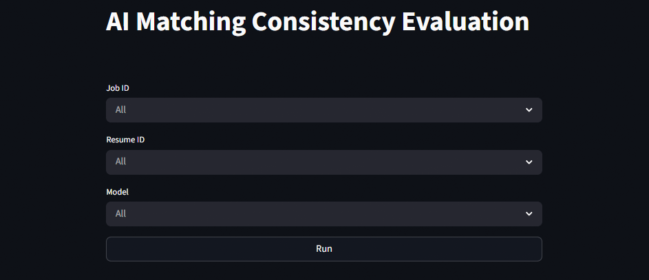
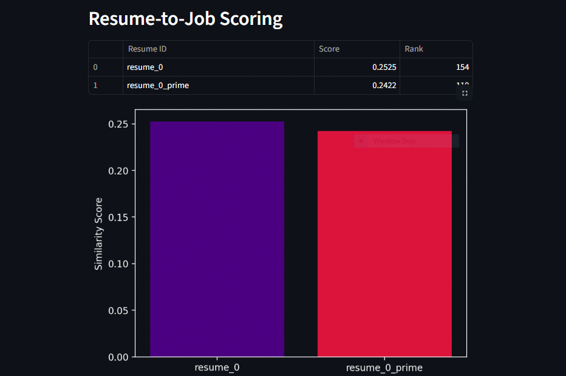
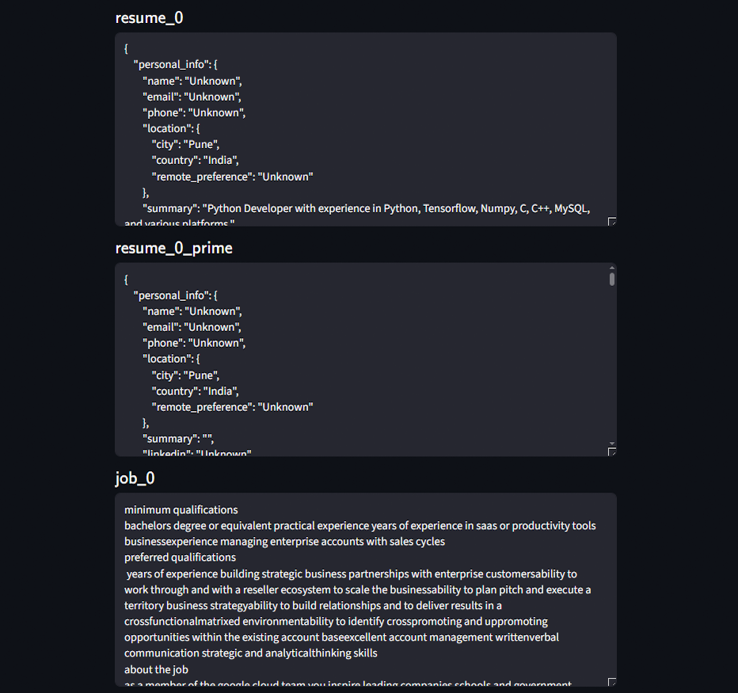
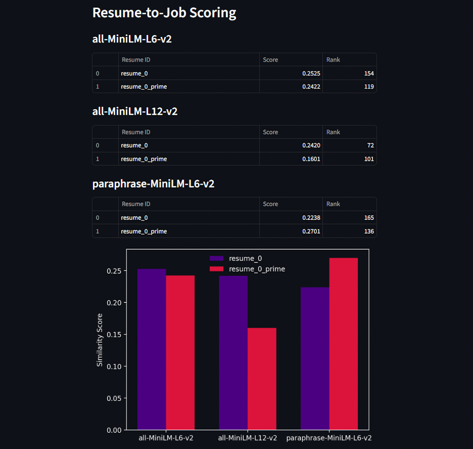
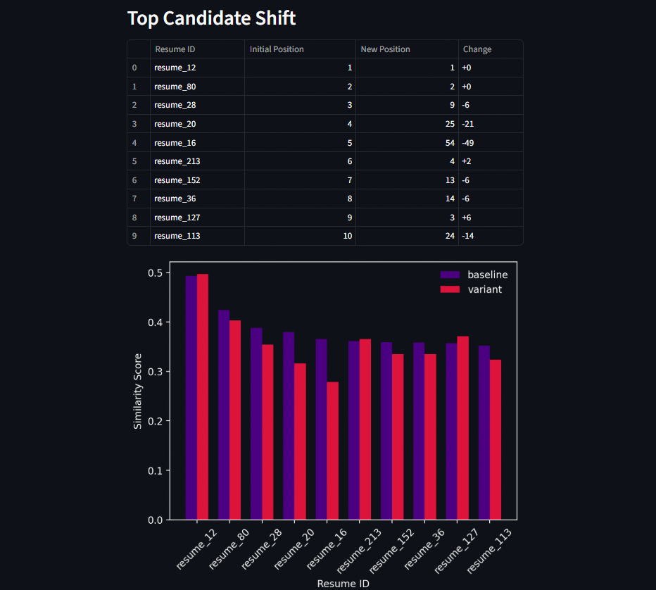
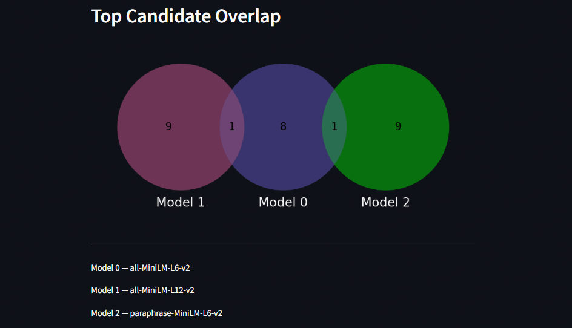
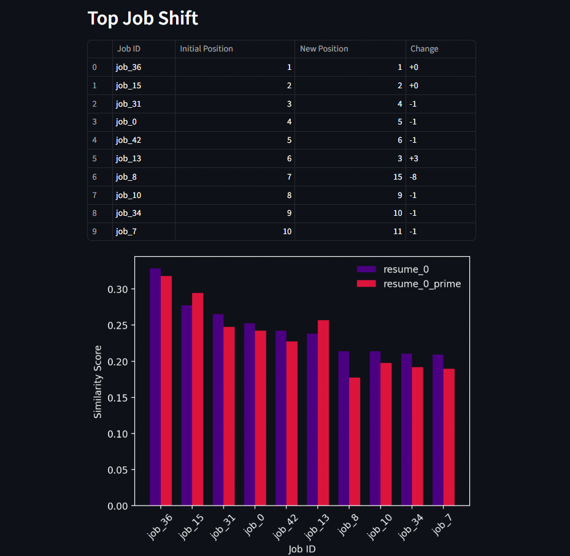
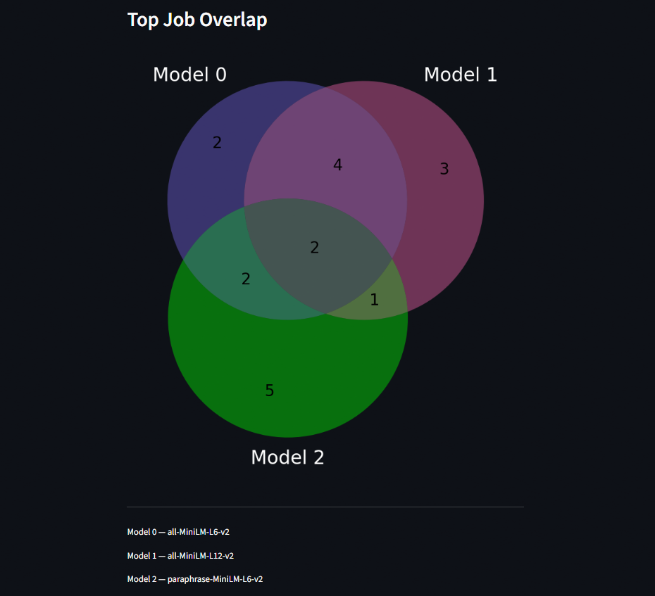
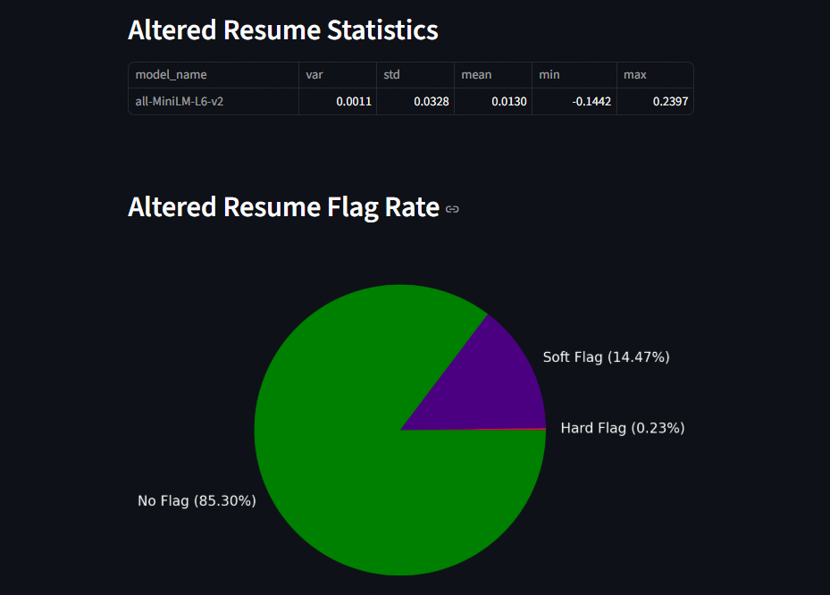
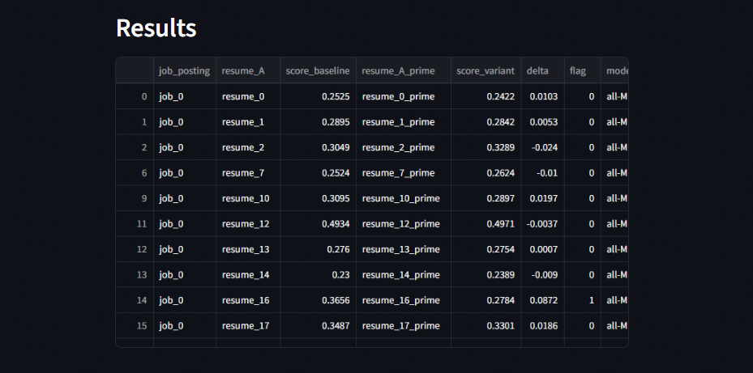

# AI Matching Consistency Evaluation

AI Matching Consistency Evaluation is a benchmark project by Pedagogue Systems exploring how different AI/ML models rank resumes against job descriptions. It investigates model agreement, scoring divergence, and the implications for fairness and explainability in staffing technology. The project highlights the importance of trust, validation, and responsible AI implementation in staffing.

The application is used to interface with the benchmark results, featuring several ways to visualize where models agree or disagree. Additionally, the app allows for viewing rankings and other statistics; the job postings, resumes, and altered resumes can also be viewed. The app’s primary function is Resume-to-Job scoring, which visualizes model ranking and provides the resume, the altered resume, and the job posting in plain text. In this experiment, the altered resume was obtained by removing the first sentence of the resume summary. However, the app can also display top candidate shift, top candidate overlap, and model statistics, among others.

## Setup & Usage

### Initialize Environment

To initialize the environment, clone the GitHub repository and install the required libraries.

```bash
git clone https://github.com/Pedagogue-Systems/ai-matching-consistency-eval.git
cd ai-matching-consistency-eval
pip install -r requirements.txt
```

### Important Files

Important files include the app, results, resumes, and job postings.

```
streamlit_app/app.py
data/results.csv
data/resumes/master_resumes.jsonl
data/job_postings/training_data.csv
```

### How to Run

The app was built using Streamlit, which is used to run the application.

```bash
streamlit run streamlit_app/app.py
```

or

```bash
python -m streamlit run streamlit_app/app.py
```

### App Navigation

The app features three drop-down menus and a ‘Run’ button. The drop-down menus can be used to narrow the options by filtering a job posting, resume, and/or model. Displayed information is based on which options are selected, so there are eight different displays. To run the application with the specified options, click the ‘Run’ button. To change the specified options, either select a new option using the drop-down menus or deselect an option using the ‘X’ located on the right side of the drop-down menus. After making new selections, the updated information will be displayed upon clicking the ‘Run’ button again.



***Figure 1**: Initial App State*

## App Functionality

### Resume-To-Job Scoring

To display resume-to-job scoring, a job, a resume, and a model must be selected. The display features a table showing resume-to-job scoring and ranking. Additionally, the altered resume score shift is visualized using a bar chart. The resume, altered resume, and job posting are displayed in plain text below the table and chart.



***Figure 2**: Resume-To-Job Scoring Table and Chart*



***Figure 3**: Resume, Altered Resume, and Job Posting Windows*

### Resume-To-Job Scoring (All)

To display resume-to-job scoring for all models, only a job and a resume must be selected. The display features a separate table for each model showing resume-to-job scoring and ranking. Additionally, the altered resume score shift for each model is visualized using a bar chart. The resume, altered resume, and job posting are displayed in plain text below the tables and chart.



***Figure 4**: Resume-To-Job Scoring (All) Tables and Chart*

### Top Candidate Shift

To display the top candidate shift, only a job and a model must be selected. The display features a table of the top ten candidates based on the initial resumes; the table shows the rank shift of the candidates based on the altered resumes. The top candidate shift is also visualized using a bar chart showing the top ten candidates’ scores before and after altering the resumes.



***Figure 5**: Top Candidate Shift Table and Chart*

### Top Candidate Overlap

To display the top candidate overlap, only a job must be selected. The display features a Venn diagram depicting the overlap of the top ten candidates for each model; the number within the sets and intersections corresponds to the number of candidates found in each. Additionally, there is a legend below the Venn diagram that indicates each model.



***Figure 6**: Top Candidate Overlap Venn Diagram*

### Top Job Shift

To display the top job shift, only a resume and model must be selected. The display features a table of the top ten jobs based on the job postings; the table shows the rank shift of the job postings based on the altered resume. The top job shift is also visualized using a bar chart showing the top ten job postings’ scores before and after altering the resume.



***Figure 7**: Top Job Shift Table and Chart*

### Top Job Overlap

To display the top job overlap, only a resume must be selected. The display features a Venn diagram depicting the overlap of the top ten job postings for each model; the number within the sets and intersections corresponds to the number of job postings found in each. Additionally, there is a legend below the Venn diagram that indicates each model.



***Figure 8**: Top Job Overlap Venn Diagram*

### Model Statistics

To display the model statistics, only a model must be selected. The display features a table showing model statistics relating to the delta between resume and altered resume scoring; these statistics include variance, standard deviation, mean, minimum value, and maximum value. Additionally, the model flag rate is visualized using a pie chart; there are three flags: no flag under 5%, soft flag between 5% and 15%, and hard flag above 15%.



***Figure 9**: Model Statistics Table and Chart*

### Display Results

To display the results, no option must be selected. The display features a table showing the raw results file used for app functionality.



***Figure 10**: Display Results from File*